# 实验八

本实验参考博客https://www.tomorrow.wiki/archives/174 DIY Shell 对Shell的讲解， 用java实现Shell的部分功能。

### Shell 概要

> shell 的中文翻译为“外壳”，它的定义就是提供接口给用户与操作系统内核交互的软件。是Linux系统下，可以大大提高生产效率的工具。类似于 Windows 下的命令提示符。简单来说就是一个可以分析并执行用户所输入的命令的软件。

shell 的工作流程应该是这样的：

1、打印命令提示符$或者#；

2、读取并分析命令；

3、执行命令；

4、执行完命令后，重复 1-3；

#### 命令类型

<b>内部命令</b>

> 内部命令实际上是shell程序本身的一部分，通常都是一些比较简单的系统命令。这些命令所实现的功能与所做工作都是由shell程序本身来完成的，也就是在shell程序的源码里面实现的，其执行速度要比外部命令快很多，因为执行内部命令时，shell无需创建新的进程产生多余的开销。常见的内部命令有：

```
exit
cd
echo
```

<b>外部命令</b>

> 外部命令区别于内建命令，通常是一些功能较为强大、复杂的命令。它由shell分析然后通过Linux内核 API 创建新的进程，在新的进程中执行，在新的进程中所执行的代码是不属于 shell 的，所以在 shell 加载时并不随之一起被加载到内存中，而是在外部命令执行时才将其调入内存中。

例如，命令 ls ，它是一个列出当前工作目录下所有文件和文件夹的命令，但是实际上 ls 本身就是一个可执行二级制程序文件，通常存放在系统的/bin 文件夹下。shell 在执行该命令时是把 ls 的可执行二级制程序文件加载到内存当中执行。常见的Linux下 shell 外部命令有：

```
ls
cat
more
grep
```

### 实验结构

本实验应实验指导书要求，对以下功能加以实现：

* 外部命令（ls,cat)

* 管道

* 输入输出重定向

  ---

  对于前面实验：

  * 实验一 :  操作系统的进程调度  
  * 实验二 ：死锁观察与避免  
  * 实验三 ：请求页式存储管理 

* 补充：实验四还未加入

主要包介绍：

#### JCommander

> [JCommander](http://jcommander.org/)是Java解析命令行参数的工具，作者是[cbeust](https://github.com/cbeust)，著有开源测试框架testNG

根据官方文档，JCommander具有的几个特点

- 注解驱动 
  它的核心功能**命令行参数定义**是基于注解的，这也是我选择用它的主要原因。我们可以轻松做到命令行参数与属性的映射，属性除了是String类型，还可以是Integer、boolean，甚至是File、集合类型。
- 功能丰富 
  它同时支持文章开头的两种命令行风格，并且提供了输出帮助文档的能力(`usage()`)，还提供了国际化的支持。
- 高度扩展 

### 代码说明

针对上方描述对代码实现进行说明：

#### JCommander 参数定义：

（如外部命令ls -l -a)

```java
 	// use List catch parameters
    @Parameter(names = {"ls"})
    List<String> ls;
```

下面的测试将放入如下结构中使用(如命令ls)：

```java
public void run(JCommander jCommander) {
        if (ls != null) {
           // do something
        }
```

### ls 功能实现

**ls命令**用来显示目标列表，在Linux中是使用率较高的命令，ls（选项）（参数）：

```
-l：以长格式显示目录下的内容列表。输出的信息从左到右依次包括文件名，文件类型、权限模式、硬连接数、所有者、组、文件大小和文件的最后修改时间等；
```

基本代码如下：

先进行 ls 的 测试：

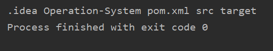

在加入参数-l :

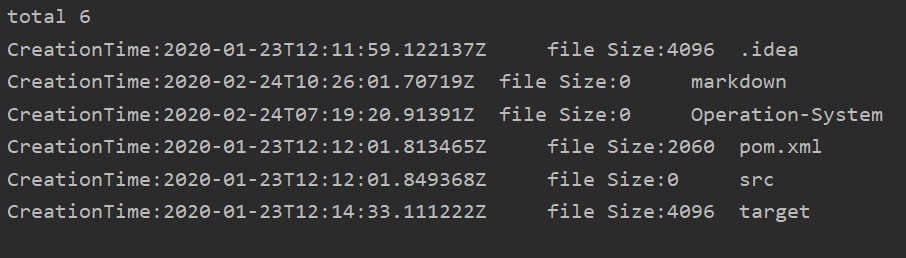

### cat 功能实现

如把 textfile1 的文档内容加上行号后输入 textfile2 这个文档里：

```
cat -n textfile1 > textfile2
```

在shell中，我们通常使用符合‘|’来表示管道，符号‘>’和‘<’表示重定向。

#### 管道

管道就是一个进程与另一个进程之间通信的通道，它通常是用作把一个进程的输出通过管道连接到另一个进程的输入。它是半双工运作的，想要同时双向传输需要使用两个管道。

例如命令`ls | grep main.c`，使用了管道来连接了两条命令来执行，能够快速地让我们知道当前目录下是否有 main.c 文件

#### 重定向

文件重定向其实与上面管道重定向到标准输入输出很类似，甚至可以直接采用上面所说的方法来实现。

在C++ 的unistd中具有很好的样本，如来自于unistd.h 中的fropen（），但java中却需要自己建造。

我们来看实现原理：

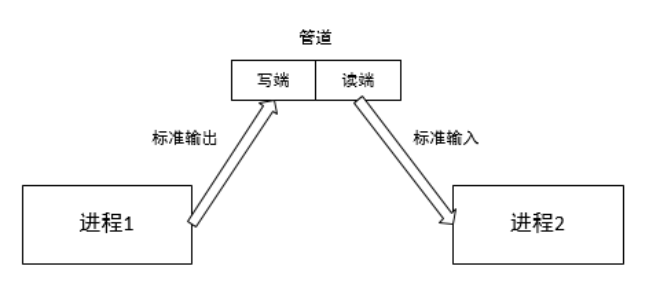


首先是创建一个管道，然后创建子进程，子进程会继承这一个管道，也就保证了父进程与子进程操作的是同一个管道（管道的继承与普通变量不同）。

```java
  private Pipe redirect(InputStream in) throws IOException {
        Pipe pipe = Pipe.open();
        Pipe.SinkChannel sinkChannel = pipe.sink();
        byte[] bytes = new byte[1024];// 1MB/time
        while((in.read(bytes))!=-1){
            sinkChannel.write(ByteBuffer.wrap(bytes));
        }
        return pipe;
    }
```

在此，定义一个管道，用于读入InputStream中的数据，而在另一个端口进行写：

```java
 private void outPutToFile(Pipe pipe, String tgtFileName) throws IOException {
        Pipe.SourceChannel sourceChannel = pipe.source();
        ByteBuffer byteBuffer = ByteBuffer.allocate(1024);
        sourceChannel.read(byteBuffer);
        final FileOutputStream fos = new FileOutputStream(tgtFileName);
        // allocate a channel to write that file
        FileChannel fc = fos.getChannel();
        // flip from filling to emptying to prepare buffer for write
        byteBuffer.flip();
        fc.write(byteBuffer);
    }
```

这是对于一个文件的输出。

### 测试

#### 	功能测试

```
cat 1.txt > 2.txt
```

建立 1.txt：

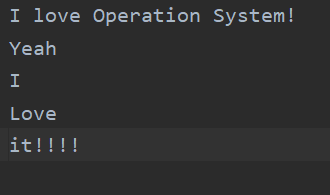

执行结果：

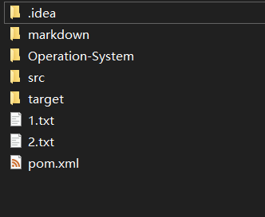

其中2.txt与1.txt相同

#### 鲁棒性测试

如果已有文件2.txt，却执行：

```
cat 1.txt > 2.txt
```

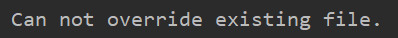

```java
if (cat != null) {
            try {
                int operationIndex = cat.indexOf(">");
                if (operationIndex != -1) {
                    List<File> fileList = Arrays.asList(getCurrentFileInfo());
                    checkAndOut(cat.get(operationIndex - 1), fileList, cat.get(operationIndex + 1));
                }
            } catch (IndexOutOfBoundsException exp) {
                System.out.println("your grammar is wrong!");
            } catch (FileNotFoundException fexp) {
                System.out.println("target file is a dictionary.");
            } catch (IOException e) {
                e.printStackTrace();
            }
```

在cat运行过程集中处理exception避免各类语法错误

执行：

```
cat > 2.txt
```

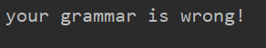

执行：

```
cat 1.txt > 
```


### 联系前面实验

设置更多的变量：

```java
	@Parameter(names = {"-s","schedule"},description = "process scheduling:" +
            "number of pcb, algorithm: {RR,Priority}")
    List<String> schedule;
    @Parameter(names = {"-b","banker"},description = "banker to prevent deadLock:"
            +"int current resources ,int[] claimed, int[] allocate")
    List<String> banker;
    @Parameter(names = {"-p","pageSchedule"},description = "memory page scheduling: " +
            "int instructionNumb,int realMemoryTableNum," + "int pageSize," + "int pageTableCacheSize")
    List<String> page;
```

设置一个检测函数，来确保输入格式的正确：

```java
private int[] getParams(List<String> args,int argSize) {
        int[] params = null;
        try{
            params = args.stream().mapToInt(Integer::parseInt).toArray();
            if(params.length!= argSize){
                throw new IllegalArgumentException("arguments wrong!");
            }
        } catch(NumberFormatException nexp){
            System.out.println("please input integer.");
        } catch (IllegalArgumentException exp){
            exp.printStackTrace();
        }
        return params;
    }
```

#### 进程调度算法测试

由于要算法选择，设置变量：

```java
@Parameter(names={"-alg"})
    List<String> alg;
```

执行：

```java
-s 3 -alg RR
```

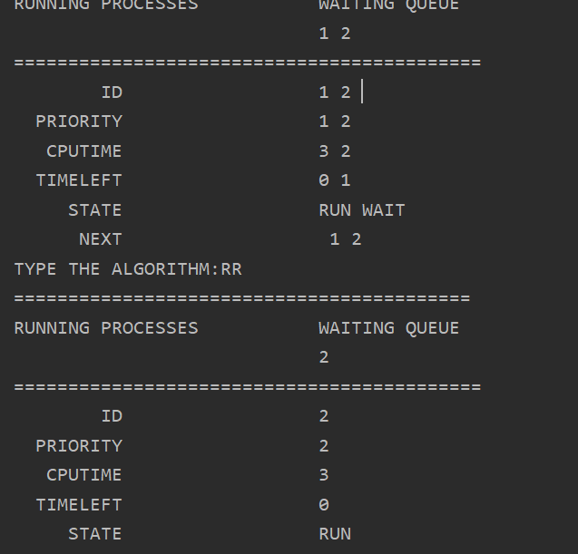

执行：

```
-s 3 -alg Priority
```

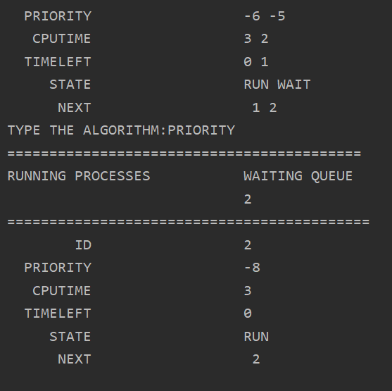

#### 银行家算法测试

由于要输入两个int【】，所以需要额外两个变量List<Integer>表示：

```java
	@Parameter(names={"-clm"})
    List<Integer> banker_claim;
    @Parameter(names={"-alo"})
    List<Integer> banker_aloc;
```

执行：

```
-b 6 -clm  10,18,8,10 -alo 3,9,7,3
```

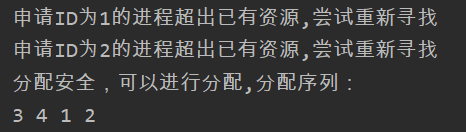

#### 页面管理测试

执行：

```
-p 50000 32 5 5
```

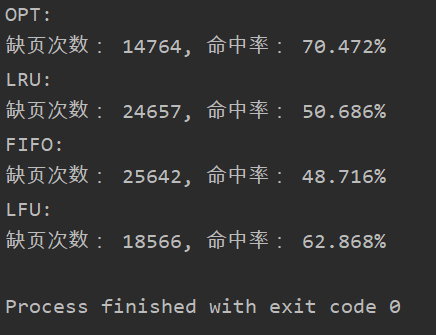

### 帮助文档

帮助文档可借助JCommander包进行输出：

```java
if (help) {
            jCommander.usage();
        }
```

执行：

```
-help
```

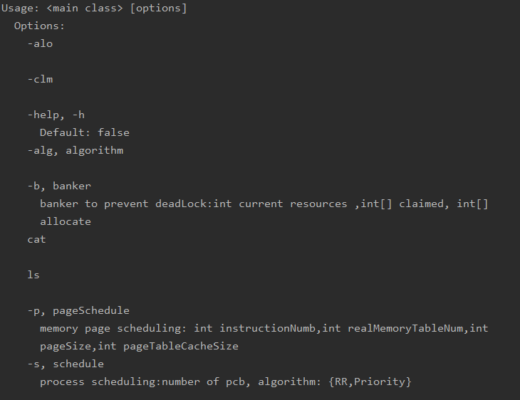

# 总结

这学期实验花了挺多心思，也实现了很多以前不知道的算法和数据结构，希望多年后还能回忆起这段时光！也感谢组内同学，与老师的无私帮助，谢谢！